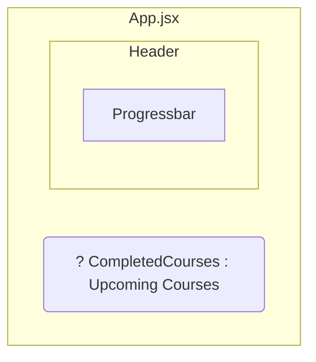
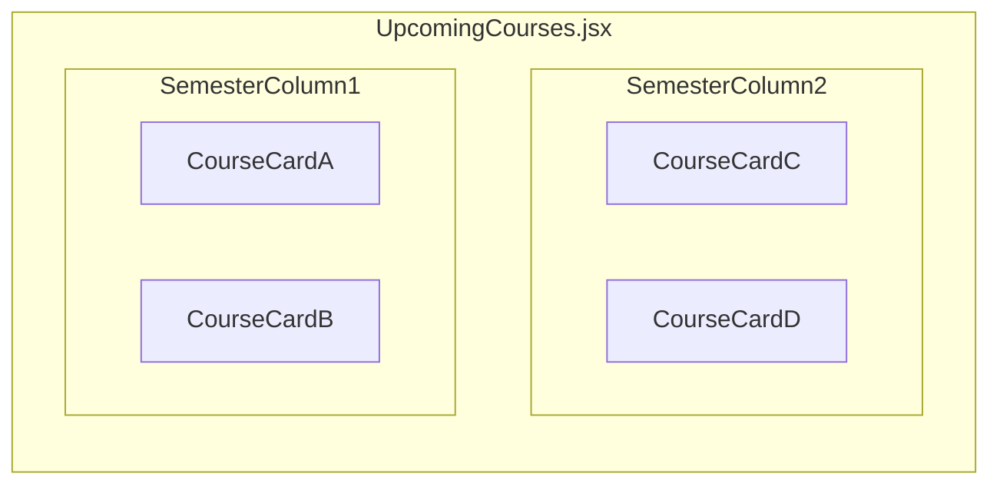

# Personal Study Plan App

As a front-end programming exercise, this personal study app is developed to account completed courses as well as add and schedule upcoming courses to plan studies for university degree program.

## Frameworks, libraries and tools used
- Axios 1.7.9
- Boxicons web icons
- JSON Server 1.0.0-beta.3
- React 18.3.1
- React Aria Components 1.5.0
- React Tooltip 5.28.0
- SweetAlert2 11.15.9

## Course data
Course data is stored in db.json file with key-value pairs demonstrated in the example below
```json
{
    "name": "Data Management and Databases",
    "module": "Professional Competencies in Business Information Technology Studies",
    "code": "SOF001AS2A",
    "credits": 5,
    "grade": 5,
    "status": "completed",
    "id": "4515"
}
```

## Back-end service
Fetching course data using back-end service courses.js comprising of Axios .get(), .post(), .put() and .delete() functions.

## Screenshots
### Header and completed courses view
Displaying total credits, progressbar and table of completed courses. Header displays completed and upcoming buttons to switch between views. Add course to render input form modal.  


### Upcoming courses view
Displaying coursecards based on course object's status. On hover Coursecard displays mark complete and delete functionalities.


### Add course


## React components

### App


### Upcoming courses components

### Add course
Add button to render AddCourseModal input form.

## Project status
- [x] CRUD functionalities with JSON Server
- [x] Views for completed and upcoming courses
- [ ] Draggable coursecards to schedule courses by semesters (drop areas)
- [ ] Converting db.json to a SQL/NoSQL database
- [ ] Deployment  
